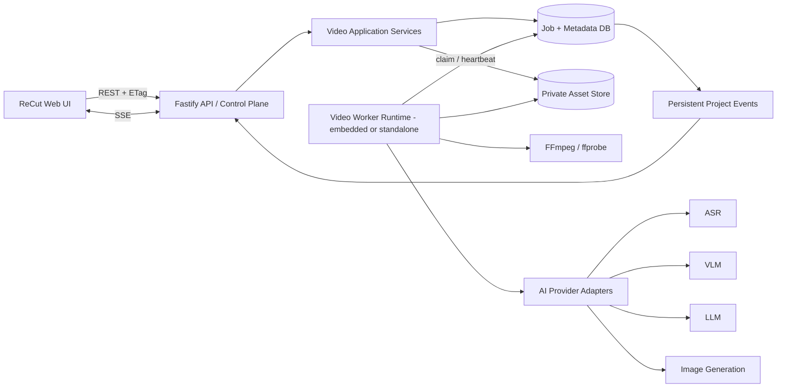

# ReCut V1 后端技术设计

| 项目 | 内容 |
|---|---|
| 文档状态 | Approved for Phase A |
| 设计版本 | 1.1.1 |
| 更新日期 | 2026-08-17 |
| 需求基线 | [ReCut V1 产品需求文档 V1.0.1](video-prd.md)（2026-08-17） |
| API 前缀 | `/api/video/v1` |

## 1. 结论与范围

### 1.1 V1 的硬边界

V1 后端只负责以下链路：

```text
参考视频 → Source Blueprint → Product Profile → Adapted Blueprint
         → 3–6 个 Storyboard → 模型中立 Prompt 包
```

- V1 不调用视频生成模型，不做 TTS、字幕烧录、时间线合成或 MP4 导出。
- 当前原型中的“生成视频”和“导出视频”必须分别改为“生成分镜”和“导出 Prompt 包”。
- V1.1 才增加逐镜视频生成；V1.2 才增加 TTS、字幕、合成与 MP4。
- URL 输入只负责校验、公开元信息与嵌入预览。无法通过被允许的官方能力取得媒体时，项目进入 `needs_video_upload`，不接入第三方下载器。
- Alpha 采用“仅上传视频”的稳定主路径，限制 Malaysia、Bahasa Melayu / English、每项目最多 6 镜。

### 1.2 与 Tibao 的关系

ReCut 复用当前仓库的 Fastify 服务、SQLite 本地部署方式，以及现有 `TibaoDatabase` / `ApiRunner` 已验证的任务租约、幂等和失败恢复思路，但不复用 TikTok 提报任务表或 `ApiRunner` 类。

视频域使用独立的路由、表前缀、服务和 Worker，避免媒体任务与商品机会提报互相耦合：

- `registerRoutes()` 挂载 `registerVideoRoutes()`。
- 本地 Alpha 继续使用同一个 SQLite 文件，新增 `video_*` 表。
- 原始素材和生成资产绝不放进 `apps/server/public`。
- TikTok 商品只是一种可选的 `catalog_context`。用户不选择店铺商品也能直接创建视频项目并上传商品图。
- 从商品列表进入时，只复制商品 ID、标题、类目、品牌和店铺地域等非敏感快照；Token、Cookie、Shop Cipher 不进入视频域。

### 1.3 市场和语言默认值

目标市场按以下优先级确定：

1. 用户显式选择的 `target_market`；
2. 关联 Tibao 商品所在店铺的 `region`；
3. Alpha 默认值 `MY`。

数据模型使用 ISO 3166-1 alpha-2 市场代码和 BCP 47 语言标签，不把实现写死为 MX 或 MY。Alpha 的产品开关只开放 `MY + ms-MY/en-MY`，以后通过配置扩展。

## 2. 设计目标

后端必须保证：

1. AI 结果都有版本化 JSON Schema，中间产物可检查、编辑和复用。
2. 后端状态是唯一事实来源；页面百分比只能由真实阶段状态计算。
3. 项目、作业和单镜均可恢复；一个场景失败不阻塞其他场景。
4. 用户编辑使用乐观锁；旧作业晚到的结果不能覆盖新版本。
5. 用户修改 Product Profile 后，只重建受影响的改编内容和未锁定场景。
6. 所有供应商密钥只在服务端；所有素材默认私有。
7. 每次模型调用能追踪供应商、模型、时延、成本和错误，但日志不保存素材、完整 URL、字幕或 Prompt 原文。
8. 导出绑定明确的 Blueprint 与场景版本，可重复生成，且不触发重新分析。

## 3. 总体架构



### 3.1 建议的仓库结构

```text
apps/server/src/video/
  routes.ts                 # /api/video/v1
  application/              # 用例、状态转换、权限与失效计算
  repository/               # SQLite / PostgreSQL repository contracts
  storage/                  # local / object-store adapters
  migrations/               # 版本化 video_* migrations

apps/video-worker/
  src/index.ts              # PostgreSQL 模式的独立进程入口

packages/video-worker/
  src/runtime.ts            # 可嵌入或独立启动的 claim / heartbeat runtime
  src/handlers/             # analyze、adapt、storyboard、export
  src/media/                # ffprobe、抽帧、音频与 contact sheet

packages/video-core/
  src/contracts/            # DTO、状态、错误码
  src/schemas/              # 版本化 JSON Schema
  src/validation/           # 时间轴、事实来源和业务规则
  src/fingerprints/         # SHA-256 输入指纹

packages/ai-providers/
  src/contracts.ts          # 能力接口
  src/registry.ts           # 按能力选择 Provider
  src/providers/            # 具体供应商适配器
```

`apps/server` 是控制面，负责短请求、持久化、状态转换和签名 URL；`packages/video-worker` 承载 Worker 运行时和处理器，`apps/video-worker` 只是生产环境的独立进程入口。API 请求不得同步等待完整分析或图片生成。

### 3.2 部署形态

| 能力 | 本地 MVP / Alpha | 公网 Beta / Production |
|---|---|---|
| API | 现有 Fastify，绑定 `127.0.0.1` | 多副本 Fastify，必须接入认证 |
| Worker | 嵌入 Fastify 进程；媒体并发 1、文本 AI 并发 2、图片 AI 并发 3 | 独立进程；CPU 媒体池与 AI 调用池分别扩容 |
| 数据库 | SQLite WAL + `busy_timeout` | PostgreSQL，使用 `FOR UPDATE SKIP LOCKED` 领取任务 |
| 作业队列 | 数据库租约队列 | PostgreSQL 租约队列；吞吐需要时再加 Redis 通知层 |
| 资产 | `data/video-assets` 私有目录 | S3 / TOS / R2 兼容的私有对象存储 |
| 上传 | 流式写临时文件后原子移动 | 客户端使用短期预签名 PUT |
| 下载 | 鉴权 API 流式读取 | 5–15 分钟有效的签名 GET |

数据库始终是作业事实来源。将来增加 Redis 时，Redis 只负责唤醒 Worker，不持有唯一状态，避免数据库和队列双写不一致。

SQLite 模式有以下硬约束：

- `VIDEO_WORKER_MODE=embedded`，API 与 Worker 共享现有 `TibaoDatabase.raw` 的同一个 `DatabaseSync` 连接；`apps/video-worker` 检测到 SQLite 时拒绝启动，避免双进程写锁让 API 事件循环在现有 5 秒 `busy_timeout` 上阻塞。
- claim、阶段转换、事件写入和完成提交都使用毫秒级短事务；事务中禁止执行 FFmpeg、网络请求、模型调用或任何 `await`。所有写事务通过 `database.transaction<T>(fn: () => NonPromise<T>)` 执行；helper 在类型层拒绝 async callback，运行时也检查 thenable 和嵌套事务并立即回滚。用 `@ts-expect-error` 类型 fixture 确保 `transaction(async () => ...)` 不能通过 typecheck。
- 租约为 180 秒，单个 Worker 每 45 秒把自己名下所有运行作业的心跳合并成一次事务；不写伪百分比，只在阶段变化时持久化进度。
- FFmpeg/ffprobe 使用异步 child process；媒体并发固定为 1。外部 AI 是 I/O 等待，Alpha 就使用独立 semaphore，Storyboard 图片默认并发 3，避免六镜完全串行。
- embedded runtime 实现幂等的 `beginDrain()` / `stop()`。收到 SIGINT/SIGTERM 后先停止 claim 并拒绝新的 Worker 工作，再中止可取消的媒体子进程、在限时内结束作业与额度状态，最后才允许 `database.close()`。未向 Provider 提交的 running job 在同一事务释放租约和预占、回到 `queued` 且 attempt 不变；已提交但成本未知的 job 进入带 `PROVIDER_RECONCILIATION_PENDING` 原因的 `retry_wait`，对应 reservation 进入 `reconciling`，不得立即重跑。`apps/server` 和独立 `apps/video-worker` 必须复用这一退出契约，开发重启不等待 180 秒租约自然过期。

生产环境切换 PostgreSQL 后，API 和 Worker 才拆成多个进程。Repository contract 测试必须保证两种模式具有相同的 claim、lease、fencing 和事件语义。

## 4. 核心模块职责

| 模块 | 职责 | 不负责 |
|---|---|---|
| Project Service | 项目配置、状态转换、复制、删除、目录商品预填 | 模型调用 |
| Upload Service | 上传会话、流式校验、校验和、媒体资产登记 | 任意 URL 下载 |
| Analysis Orchestrator | 建立分析步骤、依赖和可重试边界 | 在 HTTP 请求内执行长任务 |
| Blueprint Service | 版本、Schema 校验、确认、时间轴规则 | 保存未经校验的模型输出为正式产物 |
| Scene Service | 逐镜编辑、重生成、锁定、版本 fencing | 修改其他已锁定场景 |
| Job Repository | 幂等入队、领取、租约、心跳、重试、完成 | 业务 Prompt 拼装 |
| Asset Store | 私有对象、签名访问、删除、owner 命名空间内的内容寻址 | 对外公开静态目录 |
| Provider Registry | 按能力路由、超时、错误归一化、成本记录 | 把供应商返回直接暴露给前端 |
| Export Service | 固定版本快照、ZIP/Markdown/JSON | 重新执行分析或生成 |

## 5. API 设计

### 5.1 公共约定

- 所有路由位于 `/api/video/v1`。
- 外部 ID 使用不可预测 UUID；时间为 UTC ISO 8601。
- JSON 写操作接收 `Idempotency-Key`，幂等 scope 固定为 `HTTP method + 路由模板`。同一 owner、scope 和 key 且请求哈希相同则重放第一次响应；请求哈希不同返回 `409 IDEMPOTENCY_KEY_REUSED`。流式上传由一次性 upload session 保证幂等，不写通用响应缓存。
- 可编辑资源返回 `revision` 与 `ETag: "<revision>"`；更新必须发送 `If-Match`，冲突返回 `409 REVISION_CONFLICT`。
- 异步命令返回 `202`，包含 `job` 和 `reused`，不返回虚假完成百分比。
- 列表使用 cursor 分页，不使用不稳定的深 offset。
- 当前本地模式的 `owner_id` 固定为内部身份 `local`；一旦服务绑定非回环地址，启动检查必须要求真实认证中间件。
- SSE 仅通知“发生了变化”，REST 资源仍是最终事实来源。

### 5.2 项目 API

| 方法 | 路径 | 说明 |
|---|---|---|
| `POST` | `/projects` | 创建草稿，可带可选 `catalog_context` |
| `GET` | `/projects` | 项目列表、状态筛选、cursor 分页 |
| `GET` | `/projects/:projectId` | 返回项目聚合状态、当前产物和作业摘要 |
| `PATCH` | `/projects/:projectId` | 修改名称、市场、语言、目标时长、结构参考度 |
| `POST` | `/projects/:projectId/copies` | 复制项目；同 owner 内复用不可变 Source 产物 |
| `DELETE` | `/projects/:projectId` | 二次确认后软删除并进入资产清理队列 |
| `GET` | `/projects/:projectId/events` | SSE，支持 `Last-Event-ID` 续传 |

创建项目请求示例：

```json
{
  "name": "Portable blender MY concept",
  "catalog_context": {
    "shop_id": "optional",
    "product_id": "optional",
    "title": "Optional prefill",
    "category": "Optional prefill",
    "brand": "Optional prefill",
    "shop_region": "MY"
  },
  "target_market": "MY",
  "language": "ms-MY",
  "target_duration_sec": null,
  "similarity_score": 60
}
```

`catalog_context` 整体可省略。`target_duration_sec = null` 表示跟随原视频。目录快照只用于预填，用户仍需上传 1–6 张商品图才能开始分析。

### 5.3 来源与上传 API

| 方法 | 路径 | 说明 |
|---|---|---|
| `POST` | `/projects/:projectId/source-url/resolve` | 校验 URL、获取允许的公开元信息或返回上传降级 |
| `POST` | `/projects/:projectId/uploads` | 创建 `source_video`、`product_image` 或 `custom_storyboard` 上传会话 |
| `PUT` | `/uploads/:uploadId/content` | 仅本地存储模式使用的流式上传端点 |
| `POST` | `/uploads/:uploadId/complete` | 校验对象长度、SHA-256、MIME，并把资产置为 verifying |
| `DELETE` | `/projects/:projectId/assets/:assetId` | 从当前项目输入中移除资产；硬删除由引用图和保留策略决定 |
| `PATCH` | `/projects/:projectId/product-images` | 排序并设置主参考图 |

创建上传会话返回统一描述：

```json
{
  "upload_id": "uuid",
  "asset_id": "uuid",
  "mode": "proxy",
  "method": "PUT",
  "url": "/api/video/v1/uploads/uuid/content",
  "required_headers": { "Content-Type": "video/mp4" },
  "max_bytes": 157286400,
  "expires_at": "2026-08-17T10:00:00.000Z"
}
```

生产环境把 `mode` 换成 `presigned_put`。服务端完成回调后仍通过 `HEAD`、magic bytes、图片解码或 `ffprobe` 复核，不能信任客户端 MIME。

本地 `PUT` 不走现有 multipart：视频插件在自己的 Fastify encapsulation scope 内为 MP4/MOV/WebM/JPG/PNG/WebP 和 `application/octet-stream` 注册 stream content-type parser。现有全局 `bodyLimit = 6 MB` 和 multipart `fileSize = 5 MB` 保持不变；stream parser 不依赖 `bodyLimit`，而是在 `ByteLimitTransform` 中逐块统计字节、同步计算 SHA-256，超过该 upload session 的角色上限立即销毁流、删除临时文件并返回 413。`Content-Length` 只用于提前拒绝，不能替代实际计数。若保留 multipart 兼容入口，则每次显式调用 `request.file({ limits })`，不得放宽全局配置。

URL 解析成功但没有合法媒体时返回正常业务状态，而不是 500：

```json
{
  "status": "needs_video_upload",
  "embed_metadata": { "provider": "tiktok", "canonical_url": "..." },
  "reason": "SOURCE_MEDIA_UNAVAILABLE"
}
```

### 5.4 分析、画像和 Blueprint API

| 方法 | 路径 | 说明 |
|---|---|---|
| `POST` | `/projects/:projectId/analysis-runs` | 校验权利声明和输入后启动分析 |
| `GET` | `/projects/:projectId/source-blueprints/current` | 当前 Source Blueprint |
| `PATCH` | `/projects/:projectId/source-blueprints/:id` | 保存用户修正，要求 `If-Match` |
| `POST` | `/projects/:projectId/source-blueprints/:id/confirmations` | 冻结当前 Source 版本供改编使用 |
| `GET` | `/projects/:projectId/product-profile` | 当前 Product Profile |
| `PATCH` | `/projects/:projectId/product-profile` | 修改事实、来源或确认状态 |
| `POST` | `/projects/:projectId/product-profile/confirmations` | 确认商品画像并计算失效范围 |
| `POST` | `/projects/:projectId/adaptation-runs` | 从已确认 Source/Profile 生成新改编版本 |
| `GET` | `/projects/:projectId/adapted-blueprints/current` | 当前商品版 Blueprint |
| `PATCH` | `/projects/:projectId/adapted-blueprints/:id` | 编辑、排序、合并或拆分 3–6 镜 |
| `POST` | `/projects/:projectId/adapted-blueprints/:id/confirmations` | 校验并冻结改编结构 |

启动分析请求必须包含当前权利声明版本：

```json
{
  "expected_project_revision": 7,
  "rights_acknowledgement": {
    "accepted": true,
    "policy_version": "2026-08-15"
  }
}
```

同一输入指纹已有成功产物时返回该产物；已有运行作业时返回同一个作业；只有输入发生变化才创建新作业。

### 5.5 Storyboard API

| 方法 | 路径 | 说明 |
|---|---|---|
| `POST` | `/projects/:projectId/storyboard-runs` | 为已确认 Adapted Blueprint 建立逐镜作业 |
| `GET` | `/projects/:projectId/scenes` | 返回场景和各自独立状态 |
| `GET` | `/projects/:projectId/scenes/:sceneId` | 返回当前场景与版本信息 |
| `PATCH` | `/projects/:projectId/scenes/:sceneId` | 自动保存字段，要求场景 `If-Match` |
| `POST` | `/projects/:projectId/scenes/:sceneId/image-runs` | 按指定范围重生成场景图 |
| `POST` | `/projects/:projectId/scenes/:sceneId/prompt-runs` | 只重新生成 Prompt |
| `POST` | `/projects/:projectId/scenes/:sceneId/qc-acceptances` | 人工接受 `needs_review` 结果并留下审计记录 |
| `POST` | `/projects/:projectId/scenes/:sceneId/locks` | 锁定当前 revision |
| `DELETE` | `/projects/:projectId/scenes/:sceneId/locks/current` | 解锁，不改变内容 |
| `POST` | `/projects/:projectId/scenes/:sceneId/copies` | 复制场景并重新验证 3–6 镜和时间轴 |
| `DELETE` | `/projects/:projectId/scenes/:sceneId` | 删除场景并重新验证时间轴 |

`image-runs` 的 `regeneration_scope` 只允许：

- `keep_composition_change_action`
- `keep_product_change_environment`
- `keep_all_change_seed`
- `rebuild_from_current_fields`

每个场景单独入队。批量启动只创建多个独立子作业，不建立“全部成功才完成”的事务。

### 5.6 作业与导出 API

| 方法 | 路径 | 说明 |
|---|---|---|
| `GET` | `/jobs/:jobId` | 作业、步骤、尝试次数和可读错误 |
| `POST` | `/jobs/:jobId/retries` | 基于目标当前输入创建新的 retry job，按步骤指纹复用仍有效产物 |
| `POST` | `/jobs/:jobId/cancellations` | 尽力取消；已提交给供应商的请求可能只能丢弃结果 |
| `POST` | `/projects/:projectId/exports` | 创建 ZIP、Markdown 或 JSON 导出快照 |
| `GET` | `/projects/:projectId/exports` | 导出历史摘要 |
| `GET` | `/exports/:exportId` | 状态及短期下载地址 |

V1 不暴露视频渲染 API。若旧原型误调用相关动作，统一返回 `404 FEATURE_NOT_ENABLED`，并提供 `next_action: "export_prompt_package"`。

`POST /jobs/:jobId/retries` 不复活或改写旧 job。它在一个事务中重新读取目标当前输入，递增目标的 `generation`，生成新的指纹和 revision map，并创建带 `retry_of_job_id` 的新 job；只有输入指纹仍相同的成功步骤可复用。因此用户在失败后修改了场景再重试，会处理修改后的场景，不会因为旧 project revision 而必然 superseded。若目标已经删除、锁定或当前状态不允许生成，则返回 `INVALID_STATE_TRANSITION` 并指明下一动作。

## 6. 持久化模型

所有业务表使用 `video_` 前缀。SQLite 的 JSON 保存为 `TEXT` 并在应用层校验；PostgreSQL 使用 `JSONB`。复杂迁移改为有版本号的迁移文件，不继续把全部 DDL 堆进单个 `migrate()`。

### 6.1 核心表

#### `video_projects`

| 关键字段 | 说明 |
|---|---|
| `id`, `owner_id` | 资源与租户边界 |
| `catalog_shop_id`, `catalog_product_id`, `catalog_snapshot_json` | 全部可空；不与项目创建形成硬依赖 |
| `name`, `status`, `current_step` | 底层状态的物化投影，用于列表和恢复入口 |
| `target_market`, `language`, `target_duration_sec`, `similarity_score` | 创意配置 |
| `revision` | 每次用户可见写入原子递增 |
| `active_source_blueprint_id`, `active_product_profile_id`, `active_adapted_blueprint_id` | 当前指针 |
| `created_at`, `updated_at`, `deleted_at` | 生命周期 |

索引：`(owner_id, updated_at DESC, id)`、`(owner_id, status, updated_at DESC)`。

`status` / `current_step` 不是第二套独立事实：资产、当前 artifact、job 和 scene 状态才是规范事实。每个会改变底层状态的事务都调用纯函数 `recomputeProjectProjection()`，在同一事务更新项目投影并写事件；定期 repair job 和项目 GET 的一致性检查可修复异常投影。`partially_generated` 等聚合状态不得由路由手写。

#### `video_assets` 与 `video_project_assets`

`video_assets` 保存 `owner_id`、`kind`、私有 `storage_key`、`sha256`、探测后的 MIME、字节数、宽高、时长、状态和元数据。`video_project_assets` 保存项目角色、排序和主图标记。

- 资产内容完成后不可原地覆盖；替换文件创建新 asset。
- 同一 owner 复制项目时允许复用不可变资产；跨 owner 永不去重。
- 内容寻址 key 明确带 owner 命名空间：`owners/<HMAC(owner_id)>/<sha256>`。相同 hash 只在同一 owner 内复用，避免“内容寻址”被误实现成跨租户去重。
- `storage_key` 不返回浏览器，也不包含原文件名或用户输入路径。
- 参考视频、原音频和分析帧都有独立 kind 与保留策略。

所有非临时引用写入 `video_asset_references(asset_id, ref_type, ref_id)`，包括项目输入、Blueprint evidence、scene revision、provider output 和 export snapshot。引用不能只藏在 JSON 中；只要任何持久化 revision 或导出仍引用资产，就禁止硬删除。项目页“删除图片”只移除当前输入引用。

不允许路由或 Worker 手写 artifact row 后“记得再写”引用表。Source/Profile/Adapted、scene revision 和 export snapshot 统一经由 `persistArtifact()`：先用对应版本 Schema 验证 JSON，再根据 Schema 中声明的 `x-asset-reference` JSON pointers 提取 asset ID，最后在同一事务写 artifact 与引用行。引用变更必须通过该 repository 入口，防止 JSON 与删除门禁漂移。

#### `video_source_links`

保存加密后的原 URL、规范化 URL 哈希、host、公开嵌入元信息、解析状态和失败原因。完整 URL 不进入日志或分析埋点。

#### `video_product_profiles`

保存 `version`、`revision`、`schema_version`、`data_json`、`status`、`input_fingerprint`、`confirmed_at` 和模型元数据引用。模型生成一个 draft；用户可在 draft 内自动保存；确认后不可变，再次修改创建新版本。

#### `video_blueprints`

统一保存 `source` / `adapted` 两类 Blueprint：

- `version`, `revision`, `schema_version`, `data_json`
- `status`: `draft | confirmed | stale | superseded`
- `parent_blueprint_id`
- `product_profile_id`
- `input_fingerprint`
- `confirmed_at`

Adapted Blueprint 的每个 scene 必须带 `source_shot_ids` 和 `input_fact_refs`，供局部失效计算。

#### `video_storyboard_scenes` 与 `video_scene_revisions`

场景主表保存位置、生成状态、当前 revision、锁定 revision、单调递增的 `generation` 和 stale 原因。revision 表保存不可变的场景字段、Prompt、Storyboard asset、QC 结果、输入指纹和来源。

锁定是独立字段，不混入生成状态：

```text
generation_status: draft | queued | generating | ready | needs_review | failed
locked_revision_id: null | <revision id>
```

`needs_review` 不能直接锁定。用户人工检查后调用 `qc-acceptances` 留下理由和审计记录，服务把该 revision 转为 `ready`，之后才允许锁定。锁定后任何自动流程都不得更新 `locked_revision_id`。

#### `video_jobs` 与 `video_job_steps`

`video_jobs` 至少包含：

- `type`, `target_type`, `target_id`, `status`, `priority`
- `input_revision_map_json`, `input_fingerprint`, `target_generation`
- `idempotency_record_id`, `retry_of_job_id`, `attempt`, `max_attempts`, `next_run_at`
- `lease_owner`, `lease_expires_at`, `heartbeat_at`
- `progress_stage`, `error_code`, `error_message`, `error_retryable`
- `created_at`, `started_at`, `finished_at`, `updated_at`

关键约束与索引：

- `UNIQUE(idempotency_record_id)`；
- `(status, next_run_at, priority, created_at)` 用于领取；
- `(project_id, status, created_at DESC)` 用于项目恢复；
- `(lease_expires_at)` 用于回收崩溃作业。

`video_job_steps` 保存每一步的状态、尝试次数、输入/输出资产引用和错误。重试父作业时只重开失败步骤，已成功且输入指纹相同的步骤直接复用。

`input_revision_map_json` 只记录本作业真正依赖的资源，例如 project config revision、Source/Profile/Adapted artifact ID + revision 和目标 scene revision。不能只比较全局 `project.revision`，否则用户编辑无关场景也会错误废弃正在生成的其他场景。

#### 其他表

| 表 | 用途 |
|---|---|
| `video_upload_sessions` | 资产角色、预期 MIME/大小/哈希、临时 key、到期时间和一次性完成状态 |
| `video_idempotency_records` | owner、method+route scope、key、请求哈希、首次安全 JSON 响应和到期时间；唯一键 `(owner_id, scope, key)` |
| `video_asset_references` | 显式维护所有 artifact/revision/export 到 asset 的引用图，作为硬删除门禁 |
| `video_provider_runs` | capability、provider、model、provider request ID、token/图片数、成本、时延、错误和输入输出哈希 |
| `video_usage_budgets` | owner/project 的额度上限、已花费与已预占金额/次数 |
| `video_usage_reservations` | reservation group + job 子额度、最坏成本预占、实际回填、释放和供应商对账状态；每个 job 的预占都可独立收口 |
| `video_export_packages` | 格式、draft/final、绑定版本、manifest 哈希、storage key 与状态 |
| `video_rights_acceptances` | owner、project、政策版本、服务端时间和请求 ID |
| `video_event_cursor` | 事务锁保护的单例计数器，为事件批量分配与提交顺序一致的 ID；不使用 PostgreSQL sequence 作 dispatcher 水位 |
| `video_project_events` | 全局提交有序 event ID、project ID、事件类型和最小 payload；支持断线续传与跨进程唤醒 |
| `video_audit_events` | 用户确认、锁定、删除等关键动作，不保存素材内容 |
| `video_deletion_queue` | 软删除后的对象清理、重试和引用计数检查 |

## 7. 状态机与并发控制

### 7.1 项目状态

```text
draft
  ├─→ needs_video_upload ─→ ready_for_analysis
  └─→ ingesting ──────────→ ready_for_analysis

ready_for_analysis → analyzing → analysis_ready
                              └→ analysis_failed
analysis_failed ──retry/new run──→ analyzing

analysis_ready → adapting → adaptation_ready
                          └→ adaptation_failed
adaptation_failed ──retry/new run──→ adapting

adaptation_ready → generating_storyboard → storyboard_ready
                                         ├→ partially_generated
                                         └→ storyboard_failed
partially_generated / storyboard_failed ──retry failed scenes──→ generating_storyboard

storyboard_ready / partially_generated → exporting → exported
exported ──edit current inputs/scenes──→ storyboard_ready / partially_generated
exported ──new export snapshot────────→ exporting
```

`exported` 不是不可编辑终态。用户后续编辑导致导出快照过期时，项目回到 `storyboard_ready` 或 `partially_generated`，旧导出仍可追溯。

删除使用正交生命周期 `active → deleting → deleted`，避免把业务阶段和删除状态混在一起。

### 7.2 作业状态

```text
queued → running → succeeded
   ▲        ├─→ retry_wait ─┘
   │        ├─→ failed
   │        ├─→ cancelled
   │        └─→ superseded
   └──────── expired lease recovery
```

- Worker 领取时在事务中设置 180 秒租约；同一 Worker 每 45 秒批量刷新其全部运行作业，不为每个 job 单独开定时写。
- 进程退出或租约过期后，作业按同一 attempt 重新领取或进入下一 attempt。
- `429`、网络错误和供应商 `5xx` 使用带抖动的指数退避。
- 输入/权限/内容安全错误不可自动重试。
- JSON Schema 自动修复最多 2 次，仍失败返回 `BLUEPRINT_SCHEMA_INVALID`。

### 7.3 晚到结果 fencing

每个生成作业保存：

1. 启动时真正依赖的 `input_revision_map_json`；
2. 完整输入的 SHA-256 指纹；
3. 目标资源入队时递增后的整数 `target_generation`。

Worker 完成时使用条件更新：只有相关 revision map、输入指纹与资源当前 `generation` 三者仍匹配，并且 job 仍由当前 lease owner 持有，结果才提升为当前版本。否则作业进入 `superseded`，其输出进入短期孤儿清理，不覆盖用户编辑。不能用全局 `project.revision` 代替相关 revision map；修改 Scene 06 不应废弃 Scene 01 的运行作业。对已经发送、无法真正取消的供应商请求也采用同一规则。

`generation` 是唯一的生成世代术语，不再同时使用随机 token 和 epoch。整数只用于目标先后 fencing，输入内容相等性仍由 SHA-256 指纹负责。

### 7.4 用户重试

系统级瞬时失败在同一个 job 内增加 attempt；用户点击“重试”则创建新 job：

1. 锁定并重新读取目标当前版本；
2. 校验当前状态是否可生成；
3. 原子递增目标 `generation`；
4. 以当前输入生成新的 revision map、指纹和额度预占；
5. 写入 `retry_of_job_id`，仅复用步骤指纹仍相同的成功产物。

旧 job 和旧尝试保持只读审计记录。这样“失败后编辑再重试”明确生成编辑后的内容，而不是沿用旧快照或在完成时无声变成 superseded。

## 8. 异步处理链路

### 8.1 上传和媒体校验

1. 上传到随机临时 key，边写边计算 SHA-256 和字节数。
2. magic bytes 校验真实格式。
3. 视频由沙箱化 `ffprobe` 读取 duration、width、height、fps、音轨和 codec。
4. 校验 MP4/MOV/WebM、3–30 秒、≤150 MB。
5. 商品图实际解码，校验 JPG/PNG/WebP、≤10 MB、像素上限和 1–6 张约束。
6. 原子移动或完成对象标记，资产从 `uploading` 进入 `ready`。

失败资产不可进入分析。临时上传会话 24 小时后清理。

### 8.2 项目分析

```text
media_probe
  → shot_detection
  → frame_extraction (关键帧 + 固定间隔约 20–40 帧)
  → contact_sheet
  ├→ audio_extraction → ASR（无音轨或 ASR 失败可降级）
  └→ visual_analysis
  → timeline_fusion
  → SourceVideoAnalysis schema validate / repair

product_image_quality
  → multi_view_product_analysis
  → ProductProfile schema validate / repair
```

Source 与 Product 两个分支可以并行。ASR 失败是软失败：保留视觉分析并标记 `audio_available=false`，用户可以单独重试 ASR。确定性的 `media_probe`、帧、Contact Sheet 和音频资产按输入指纹复用。

用户看到的六个分析阶段是上述内部步骤的稳定映射，状态来自 `video_job_steps`，不由计时器模拟。

### 8.3 商品改编

前置条件：

- Source Blueprint 已确认；
- Product Profile 已确认；
- 将用于字幕/口播的敏感推测事实已由用户确认；
- 市场、语言、目标时长和结构参考度合法。

LLM 输出 Adapted Blueprint 后，服务端执行：

- scene 数 3–6；
- `source_shot_ids` 引用存在；
- `input_fact_refs` 引用已确认事实；
- 时间不重叠，总时长误差 ≤0.5 秒；
- CTA、保留项、重写项和改写原因完整；
- “永不保留”版权规则与禁用表达检查。

### 8.4 Storyboard

确认 Adapted Blueprint 后，为每个场景创建独立作业：

```text
structured scene
  → model-neutral image/video Prompt
  → safety validation
  → 9:16 image generation
  → product-presence / visual-consistency / text-anomaly QC
  → ready | needs_review | failed
```

初次创建 3–6 个场景作业前，服务在同一事务为整批最坏估算成本做全量预占；额度不足时整批不入队，避免只生成半批。作业仍逐镜独立执行，Alpha 的图片 Provider semaphore 默认并发 3。首个场景完成后立即通过 SSE 通知。

QC 低置信度必须是 `needs_review`，不能静默标记成功，也不能直接锁定。用户显式接受 QC 后才转为 `ready`。重生成一个场景时只递增该场景 `generation`，其他场景不变。

### 8.5 导出

创建导出时固定以下版本：Source Blueprint、Product Profile、Adapted Blueprint、每个场景 revision 和 Storyboard asset。Worker 从该不可变快照生成：

```text
project-summary.md
source-blueprint.json
product-profile.json
adapted-blueprint.json
prompts.md
storyboards/scene-01.png ...
manifest.json
```

至少一镜有效即可导出 `draft`。只有同时满足以下条件才标记 `final`：

- Adapted Blueprint 是当前已确认版本，且其 Source Blueprint / Product Profile 仍是当前已确认版本；
- 全部场景 `generation_status = ready`，且 `stale_reason IS NULL`，没有 `needs_review` 或 `failed`；
- 每个场景锁定的 revision 就是当前 revision，且 QC 已通过或有人工接受审计；
- 时间轴和全部 JSON Schema 在导出快照上再次校验通过。

任一条件不满足时只能导出 `draft`。客户端显式请求 `final` 时不能静默降级；服务端返回 `409 EXPORT_FINAL_BLOCKED`，`details.blocking_scenes` 逐项给出 `scene_id`、显示序号和机器可读 reason（`not_ready | needs_review | stale | current_revision_unlocked | qc_unaccepted`），同时提示仍可主动导出 draft。`manifest.json` 无论 draft/final 都逐镜记录 generation status、staleness、QC 结论、人工接受记录和锁定 revision，不能只靠包级标签隐藏风险。默认并且 Alpha 始终排除原视频、原音频与原字幕全文；manifest 同时保存每个文件的 SHA-256。

## 9. 版本、幂等和局部失效

### 9.1 输入指纹

所有可复用步骤使用规范化 JSON 后的 SHA-256：

```text
fingerprint = sha256(
  schema_version
  + input_asset_sha256[]
  + confirmed_artifact_ids/revisions
  + relevant_project_config
  + provider/model/prompt_template_version
)
```

模型、Prompt 模板或 Schema 版本变化必须进入指纹，避免错误复用旧产物。

### 9.2 请求幂等

JSON 写请求先规范化 body 并计算请求哈希，再在业务事务中插入 `video_idempotency_records`：

- `(owner_id, method + route template, key)` 不存在：执行写入并保存首次安全 JSON 响应；
- 已存在且请求哈希相同、状态 completed：原样重放状态码和响应；
- 已存在且请求哈希相同、状态 processing：返回首次创建的 job/resource 引用或 `REQUEST_IN_PROGRESS`；
- 已存在但请求哈希不同：返回 `IDEMPOTENCY_KEY_REUSED`，绝不执行第二次。

记录默认保留 24 小时。上传字节流不缓存响应正文，由 `video_upload_sessions` 的一次性状态与最终 SHA-256 处理重放。ETag 只在首次执行时校验；同 key 的合法重放不会因资源 revision 已增长而变成冲突。

### 9.3 Product Profile 修改

每个 Fact 有稳定 `fact_id` 和 JSON path；每个 Adapted scene 声明 `input_fact_refs`。确认新 Profile 时：

1. 比较新旧 Fact 值和确认状态；
2. 找出引用变化 Fact 的 Adapted scenes；
3. 创建新的 Adapted Blueprint 版本，复制未受影响 scene，只重新改编受影响 scene；
4. 只把受影响且未锁定的 Storyboard scene 标记 `stale`；
5. 已锁定 scene 保持原 revision，并显示“基于旧商品事实”的警告，只有用户解锁后才能更新。

Source Blueprint 完全不受 Product Profile 修改影响。若依赖映射缺失或商品类别发生根本变化，采用保守策略：全部改编 scene 受影响，但仍不自动改写已锁定 scene。

### 9.4 Source Blueprint 修改或补跑 ASR

已确认 Source Blueprint 永远不可原地修改。用户修正 Source，或在 ASR 软失败后补跑成功时，系统创建新的 Source draft，保留旧 confirmed 版本作为当前可用基线。只有用户确认新 draft 后才切换 active Source，并在同一事务执行下游失效：

1. 所有引用旧 Source 的 Adapted Blueprint 标记 `stale`；
2. 基于这些 Adapted 版本的未锁定 Storyboard scene 标记 `stale`；
3. 已锁定 scene 保持原 revision，但必须把“基于旧 Source”写入场景主表的 `stale_reason`，不能另建一个不受导出门禁检查的旁路标记，因此不能进入 final 导出；
4. 既有导出包保持不可变，并继续标注其绑定的旧 Source version；
5. 后续 adaptation-run 必须选择当前已确认 Source。

ASR 重试不会静默重写已确认 Source 或自动触发全链路花费。若补跑结果的规范化输入/产物指纹与当前版本相同，则直接复用，不产生失效。

### 9.5 结构参考度和市场修改

修改结构参考度、市场、语言或目标时长会创建新的 Adapted Blueprint 版本，不覆盖已确认版本。未锁定场景进入 stale；锁定场景继续固定到旧版本，等待用户显式解锁或复制到新方案。

### 9.6 Schema 升级

已确认产物固定携带生成时的 `schema_version`，Schema 发布新版本不会自动把存量项目或导出标记 stale。读取层保留版本化 decoder/validator；需要使用仅新 Schema 支持的能力时，显式迁移会创建新的 draft artifact，原 confirmed 版本继续不可变、可读和可导出。只有用户确认迁移后的 draft，才按上述规则切换 active 指针并失效下游。

## 10. AI 输出协议与校验

Schema 文件放在 `packages/video-core/src/schemas`：

- `source-video-analysis.v1.json`
- `product-profile.v1.json`
- `adapted-blueprint.v1.json`
- `storyboard-scene.v1.json`
- `prompt-package-manifest.v1.json`

全部 Schema：

- 使用 `schema_version: "1.0"`；
- 关闭未声明字段；
- 时间最多两位小数；
- 枚举未知值统一为 `other` 并保留原始描述；
- confidence 统一为 `0..1`；
- 生成后先做 JSON Schema，再做跨字段业务校验。

Product Profile 的 Fact 统一结构：

```json
{
  "fact_id": "material.primary",
  "value": "food-grade plastic",
  "source": "inferred",
  "confidence": 0.72,
  "evidence": [{ "asset_id": "uuid", "region": [0.1, 0.2, 0.8, 0.9] }],
  "confirmed_by_user": false
}
```

SourceVideoAnalysis 的业务校验包括镜头不重叠、有效时长覆盖 ≥90%、purpose/evidence/confidence 完整。AdaptedBlueprint 额外校验 `source_shot_ids`、事实引用、3–6 镜和目标总时长。

模型原始输出不进入普通日志。正式库只保存验证后的产物、输入输出哈希和必要的模型元数据；开发环境如需调试原始响应，必须使用显式开关、加密临时存储和短保留期。

## 11. Provider Adapter

V1 定义以下能力，而不是绑定具体供应商：

```ts
interface TranscriptionProvider {
  transcribe(input: AudioInput, context: ProviderContext): Promise<ProviderResult<Transcript>>;
}

interface VisionAnalysisProvider {
  analyzeVideo(input: FrameBundle, context: ProviderContext): Promise<ProviderResult<VisualAnalysis>>;
  analyzeProduct(input: ProductImageBundle, context: ProviderContext): Promise<ProviderResult<ProductProfile>>;
}

interface TextGenerationProvider {
  buildSourceBlueprint(input: AnalysisBundle, context: ProviderContext): Promise<ProviderResult<SourceVideoAnalysis>>;
  adaptBlueprint(input: AdaptationInput, context: ProviderContext): Promise<ProviderResult<AdaptedBlueprint>>;
  buildScenePrompts(input: SceneInput, context: ProviderContext): Promise<ProviderResult<ScenePrompts>>;
}

interface StoryboardImageProvider {
  generate(input: StoryboardImageInput, context: ProviderContext): Promise<ProviderResult<GeneratedImage>>;
}
```

统一的 `ProviderResult` 返回 provider、model、provider request ID、usage、estimated cost、latency 和安全结果。适配器把错误归一化为 `transient | rate_limited | invalid_output | policy | permanent`。

付费 Provider 调用使用持久化的 `video_provider_runs` 日志：网络请求前先写 `prepared` 与内部幂等键，供应商接受后尽快写 `submitted` 和 request ID，返回后写 `succeeded | failed` 与 usage。在“请求可能已被接受，但本地没拿到 request ID”的网络模糊区间一律记为 `outcome_unknown`，进入对账而不是释放额度并盲目重试。

V1.1 的 `VideoGenerationProvider` 与 V1.2 的 `TtsProvider` / `Composer` 可以预留 TypeScript contract，但不注册实现、不创建 UI 能力，也不接受 V1 API 作业类型。

## 12. 错误协议

所有非 2xx 使用统一结构：

```json
{
  "error": {
    "code": "STORYBOARD_PARTIAL_FAILED",
    "message": "2 个场景生成失败，4 个已完成场景已保留",
    "retryable": true,
    "preserved": ["scene-01", "scene-02", "scene-03", "scene-04"],
    "next_action": "retry_failed_scenes",
    "request_id": "req_uuid"
  }
}
```

PRD 中的业务错误码原样保留，并补充：

| 错误码 | HTTP | 含义 |
|---|---:|---|
| `REVISION_CONFLICT` | 409 | 客户端 revision 已过期，需刷新后合并 |
| `IDEMPOTENCY_KEY_REUSED` | 409 | 同一 scope/key 被用于不同请求正文 |
| `REQUEST_IN_PROGRESS` | 409 | 相同幂等请求仍在首轮事务中，客户端稍后重放 |
| `INVALID_STATE_TRANSITION` | 409 | 当前状态不允许该动作 |
| `JOB_ALREADY_RUNNING` | 409 | 返回现有 job ID，不重复创建 |
| `ASSET_NOT_READY` | 409 | 上传仍在校验 |
| `UPLOAD_TOO_LARGE` | 413 | 超过角色对应大小限制 |
| `TIMELINE_INVALID` | 422 | 重叠、镜数或总时长不合法 |
| `RIGHTS_ACKNOWLEDGEMENT_REQUIRED` | 422 | 未确认素材权利 |
| `USAGE_BUDGET_EXCEEDED` | 409 | 当前 owner/project 额度状态无法原子预占本次生成的最坏估算成本 |
| `EXPORT_FINAL_BLOCKED` | 409 | 请求 final 但有场景未 ready、stale、未锁定当前 revision 或 QC 未接受；返回阻塞场景清单 |
| `FEATURE_NOT_ENABLED` | 404 | V1 未开放视频/TTS/MP4 能力 |
| `PROVIDER_UNAVAILABLE` | 503 | 供应商暂不可用且重试已耗尽 |

服务端内部错误消息和供应商响应不得原样返回客户端。

## 13. SSE 与恢复

`video_project_events.event_id` 是数据库全局单调且与提交顺序一致的 ID，并包含 `owner_id`、`project_id`、事件类型和最小 payload。底层状态变更与 event row 必须在同一数据库事务提交。SSE 的 `id:` 直接使用全局 `event_id`；同一项目因其他项目事件而出现 ID 间隙是合法的。

事件类型至少包括：

- `project.updated`
- `job.updated`
- `job.step.updated`
- `blueprint.updated`
- `scene.updated`
- `export.ready`

SSE 发送小型引用 payload，例如 `scene_id`、`status`、`revision`，不发送 Blueprint 全文或签名 URL。客户端收到事件后重新读取资源。

### 13.1 投递与跨进程唤醒

API 进程只创建一个 `ProjectEventDispatcher`，内部维护 `Map<projectId, Set<connection>>`，严禁每个 SSE 连接各开一个数据库 poller：

- 事件必须统一由 `appendProjectEvents()` 写入。该 repository 方法在业务事务末尾锁定 `video_event_cursor` 单例行，用 `UPDATE ... RETURNING` 为本事务的 N 个事件分配连续 ID，再写入 event rows；行锁直到 commit/rollback 才释放，因此更大 ID 不可能先提交。
- PostgreSQL 禁止用 `BIGSERIAL` / sequence 直接作 dispatcher cursor，因为 sequence 分配顺序不等于事务提交顺序。SQLite Alpha 当前的单 `DatabaseSync` 连接天然串行，但仍复用同一 allocator；将来即使拆多连接，也不能绕过这个提交有序契约。
- SQLite Alpha 为 embedded Worker。事务提交后通过进程内 notifier 唤醒 dispatcher；dispatcher 仍按 `event_id > cursor` 从事件表读取，进程通知不是事实来源。
- PostgreSQL 模式在写事件的事务中执行 `NOTIFY video_project_event`，提交后唤醒 API listener；断线或丢通知仍通过提交有序的事件表补齐。
- dispatcher 有连接时以 500 ms 轮询作为一致性兜底；连续 3 次为空后指数退避到 2 秒，有新事件立即恢复 500 ms。没有任何 SSE 连接时停止轮询。
- 每次最多读取 500 条并按 `project_id` 扇出。多个 API 副本各自维护 cursor，互不依赖内存共享。

通知只降低延迟；数据库 event log 保证不丢事件。这个约束也允许将来用 Redis 替换唤醒层，而不改变恢复语义。

### 13.2 连接、续传与鉴权

- 建立连接时先完成 owner/project 授权，再注册 subscriber 并按 `Last-Event-ID` 回放；实时投递与回放可能重复，连接按 `event_id` 去重，不能漏事件。
- 15 秒发送注释 heartbeat；服务保留最近 7 天或每项目最近 10,000 个事件。
- `Last-Event-ID` 早于保留窗口时先发送 `resync_required`，客户端全量刷新项目后以最新 event ID 重连。
- SSE 不可用时前端退化为 3–5 秒 REST 轮询。
- Alpha 仅限 loopback 同源访问。Beta 采用同源、`HttpOnly; Secure; SameSite=Lax` 的会话 Cookie；原生 `EventSource` 会携带同源 Cookie，跨子域时显式 `withCredentials` 并做严格 Origin/CORS 校验。
- 禁止把 bearer token 放进 query string。若部署方只支持 Authorization header，则前端改用基于 `fetch()` 的 SSE stream，而不是原生 EventSource。所有状态写请求另做 CSRF 防护。

## 14. 安全、隐私和版权

### 14.1 输入边界

- 本地上传必须流式处理，不能把 150 MB 视频全部读入内存。
- 当前 Fastify 全局 `bodyLimit` 是 6 MB、multipart 默认文件上限是 5 MB，且原始 `video/mp4` 没有 content-type parser。视频插件必须使用 scoped stream parser + 自行计数字节的 `ByteLimitTransform`；不能只调高全局限制，也不能假设 stream 模式会受 `bodyLimit` 保护。multipart 兼容入口按每次 `request.file({ limits })` 覆盖，避免放宽 Excel/CSV 导入接口。
- 使用 magic bytes、真实解码和 `ffprobe`，不信任扩展名、Content-Type 或客户端时长。
- FFmpeg 使用参数数组而非 shell 拼接；限制 CPU、时间、像素、帧数和临时目录。
- URL 解析仅允许 HTTPS、支持的 TikTok host 和受控重定向；每次重定向重新验证 host/IP，禁止访问 loopback、私网、link-local 和云元数据地址。
- Alpha 不从 URL 下载媒体，因此 URL 只产生公开嵌入元信息或上传降级。

### 14.2 资产与权限

- 对象存储 bucket 私有，签名 URL 有效期 5–15 分钟。
- API 对每个 project、asset、job 和 export 执行 `owner_id` 校验，不能只依赖不可猜 ID。
- Provider key、对象存储密钥和目录商品 Token 只在服务端环境变量或 Secret Manager。
- 本地资产目录权限为 `0700`，路径位于静态目录之外。
- 项目软删除后立即不可访问；清理 Worker 只依据 `video_asset_references` 的显式引用图判断，在 24 小时内删除没有任何 revision/export 引用的对象并记录结果。
- 复制项目共享的不可变资产使用引用计数，最后一个引用删除后才清理。

### 14.3 内容和模型边界

- 用户在启动分析时留下版本化权利声明审计记录。
- OCR、字幕、转录和图片内容均视为不可信数据，不能成为系统指令；Provider Prompt 使用明确的数据边界和结构化输出。
- 检测 Logo、公众人物、未成年人、敏感内容或未确认功效时，进入提醒、人工确认或 `CONTENT_RESTRICTED`。
- 原人物身份、面部、声音、Logo、逐字字幕、音乐和水印不得作为默认保留变量。
- 分析埋点不包含完整媒体 URL、图片、字幕、转录或 Prompt。

公网部署前必须完成真实登录、租户授权、隐私政策、供应商数据处理披露和保留期确认；不能简单把当前 `HOST` 改成 `0.0.0.0`。

## 15. 可观测性、成本与配额

结构化日志公共字段：

```text
request_id, owner_id_hash, project_id, job_id, job_type, step,
provider, model, provider_request_id, attempt, latency_ms,
estimated_cost_micros, error_code
```

关键指标：

- 各阶段 queued/running/succeeded/failed 数量和 P50/P75/P95；
- 租约过期、自动重试和 superseded 结果数量；
- JSON Schema 首次失败率与修复失败率；
- 首镜时延、全项目时延、单镜返工次数；
- Provider 429/5xx/安全拒绝率；
- 每个有效创意包的模型成本；
- 孤儿临时文件、待删除对象和导出失败数量。

Alpha 不做计费，但在 `video_provider_runs` 完整记录用量，并设置：

- 每 owner 同时运行项目数；
- 每项目自动重试上限；
- 每项目图片生成次数和成本硬上限；
- Provider 超时与熔断。

额度检查必须采用“预占 → 调用 → 回填”，不能在每个并发 scene 调用前只做一次 SELECT：

1. 入队事务使用条件 UPDATE 原子增加 `reserved_cost_micros` / `reserved_units`，条件为 `spent + reserved + estimate <= limit`；受影响行为 0 时返回 `USAGE_BUDGET_EXCEEDED`。
2. 初次 Storyboard 批次先创建 reservation group，原子预占 3–6 镜最坏估算总额，再在同事务为每个 scene job 分配子额度并入队；不允许六个 job 各自 check-then-spend。
3. reservation 状态机为 `held → settled | released | reconciling`，并强绑 `job_id` / `attempt`。Worker 成功后按 Provider 实际 usage 结算到 spent 并释放差额；调用前失败、取消或 superseded 则释放全部。若 superseded 发生在已知 Provider 计费之后，仍按实际 usage 结算，不得因产物未采用而隐藏成本。
4. 所有 job 终态统一调用 `finalizeJob()`，在同一事务收口 job、step、reservation、project projection 和 event。终态 job 不允许仍持有 `held` reservation：只能已结算、已释放，或因供应商结果未知明确进入 `reconciling`。
5. 租约过期回收时，若没有 Provider 提交记录，在同一事务释放子预占、清空租约并把 job 放回 `queued`，attempt 不变；下次 claim 重新原子预占。若已提交 Provider 但响应未知，reservation 转为 `reconciling`，通过 provider request ID 对账后再结算，期间不得重跑同一付费步骤。
6. repair job 扫描“终态 job 仍 held”、“held 但无有效 lease”和超过对账 SLA 的记录，使用同一 `finalizeJob()` / reconciliation 路径修复并告警，不直接手改账本。

触发硬上限时保留已有产物并返回可解释错误，不静默继续花费。

## 16. 配置

建议新增：

```dotenv
VIDEO_FEATURE_ENABLED=true
VIDEO_STORAGE_DRIVER=local
VIDEO_STORAGE_ROOT=data/video-assets
VIDEO_TEMP_ROOT=data/video-tmp
VIDEO_MAX_SOURCE_BYTES=157286400
VIDEO_MAX_PRODUCT_IMAGE_BYTES=10485760
VIDEO_WORKER_MODE=embedded
VIDEO_JOB_POLL_MS=1000
VIDEO_JOB_LEASE_SECONDS=180
VIDEO_JOB_HEARTBEAT_SECONDS=45
VIDEO_WORKER_SHUTDOWN_GRACE_MS=10000
VIDEO_MEDIA_CONCURRENCY=1
VIDEO_TEXT_AI_CONCURRENCY=2
VIDEO_IMAGE_AI_CONCURRENCY=3
VIDEO_EVENT_POLL_ACTIVE_MS=500
VIDEO_EVENT_POLL_IDLE_MS=2000
VIDEO_ALLOWED_MARKETS=MY
VIDEO_ALLOWED_LANGUAGES=ms-MY,en-MY
VIDEO_ASSET_RETENTION_DAYS=30
VIDEO_DATA_ENCRYPTION_KEY=another-server-side-secret
VIDEO_ASR_PROVIDER=provider-id
VIDEO_VISION_PROVIDER=provider-id
VIDEO_TEXT_PROVIDER=provider-id
VIDEO_STORYBOARD_PROVIDER=provider-id
```

具体 Provider key 使用各自环境变量或 Secret Manager。`VIDEO_DATA_ENCRYPTION_KEY` 用于完整来源 URL 等视频域敏感元数据，必须与 TikTok Token 加密密钥分开。启动时校验 lease ≥ 3 × heartbeat、目录不位于 public 下、大小限制和允许的市场/语言组合；SQLite 配置非 embedded worker 时直接启动失败。

## 17. 测试策略与 UAT 映射

| PRD 场景 | 后端自动化验收 |
|---|---|
| UAT-01 正常上传 | 15 秒 fixture + 3 图，跑 fake Provider，验证 3–6 镜和 ZIP manifest |
| UAT-02 URL 降级 | 支持 URL 返回 `needs_video_upload`；上传后沿用同 project ID |
| UAT-03 无音轨 | ffprobe 无音轨，ASR step 为 skipped，Source Blueprint 成功 |
| UAT-04 画像修正 | 修改 material 后只失效引用该 fact 的未锁定场景 |
| UAT-05 参考度变化 | 30 → 90 创建新 Adapted 版本，不覆盖已确认版本 |
| UAT-06 单镜重做 | 五镜锁定，一镜 generation 增加；旧作业晚到不能覆盖 |
| UAT-07 局部失败 | 两个 image job 失败，四个 ready 可读、可锁定 |
| UAT-08 本地化 | `MY + ms-MY` 输出通过长度与事实引用校验 |
| UAT-09 导出完整性 | ZIP 文件齐全、JSON Schema/哈希通过；stale 或 needs_review 场景不能生成 final |
| UAT-10 权利与安全 | 无声明禁止启动；复制人物/Logo 请求被规则拦截 |

还需要四层测试：

1. `video-core` Schema、时间轴、指纹和失效规则单元测试；
2. Repository contract 测试，覆盖 SQLite，生产前覆盖 PostgreSQL；
3. API 注入测试，覆盖 owner 隔离、ETag、幂等和错误协议；
4. Worker 集成测试，使用固定 FFmpeg fixture 与 fake Providers，模拟崩溃、超时、429、晚到结果和部分失败。

评审问题必须各有回归测试：

- 多个 SSE 连接共享一个 dispatcher；embedded notifier、500 ms/2 s fallback poll、`Last-Event-ID` 回放均不丢事件；
- PostgreSQL 两个事务交错写事件时，后开始但先完成的事务不能让 dispatcher 跳过另一事务；SQLite 与 PostgreSQL 都用 commit-ordered allocator 通过 contract 测试；
- SQLite 下独立 Worker 拒绝启动，长 Provider/FFmpeg 子进程期间普通 API 不被同步数据库写锁卡住；
- embedded Worker 在 running job 中收到 SIGTERM 时，按 stop claim → 中止/收口 → 释放租约 → 关库的顺序退出；未调 Provider 的 job 可立即重新 claim，不等待 180 秒；
- `database.transaction()` 的 type fixture 拒绝 async callback，运行时测试也拒绝 thenable 和嵌套事务；
- 原始 MP4 PUT 能超过全局 6 MB 但在 150 MB 精确截断，不出现 415，临时文件可清理；
- 失败后编辑再重试会创建新 job 和新 generation，采用当前输入；
- 已确认 Source 在 ASR 补跑并确认新版本后，旧 Adapted 与未锁定 scene 正确 stale；
- 相同 idempotency key 在不同 route scope 可用，同 scope 不同 body 返回冲突；
- 六个并发 scene 不能突破原子预占的项目额度；
- job 在 Provider 调用前崩溃、租约过期或进入 superseded 后 `reserved` 回到原值；任何终态 job 都不遗留 held reservation，未知 Provider 结果只能进入 reconciling；
- `needs_review`、stale 或未锁定当前 revision 的场景无法进入 final；
- 请求 final 被拦截时返回 `EXPORT_FINAL_BLOCKED` 与准确的阻塞场景/原因，不静默降级为 draft；
- 经 `persistArtifact()` 保存的每个 Schema 资产引用都在同一事务出现于 `video_asset_references`；漏引用的 fixture 无法通过持久化或删除门禁测试；
- 旧 Schema 的 confirmed artifact 在 Schema 升版后仍可读取，不自动 stale；
- Beta SSE 使用 Cookie 或 fetch stream 鉴权，任何 token 都不进入 URL/query 日志。

合并门禁：`npm run typecheck`、`npm test`、`npm run build`，并增加 JSON Schema fixture 与导出包快照校验。

## 18. 实施顺序

### Phase A：后端骨架与原型联通

- 建立 `video-core`、视频路由、版本化迁移、私有本地存储和可嵌入的 `video-worker` runtime；SQLite 明确禁止独立 Worker 进程，runtime 实现有界的优雅退出。
- 完成 scoped raw stream 上传 parser、Job/Step、批量租约心跳、单 dispatcher SSE relay、同步事务 helper、乐观锁、幂等记录、额度预占/回收和 fake Provider。
- 让现有原型读取真实项目状态；修正文案为“生成分镜 / 导出 Prompt 包”。
- 支持不选 Tibao 商品直接创建项目；选择商品时只做可选预填。

### Phase B：真实 V1 链路

- 接入 FFmpeg/ffprobe、ASR、VLM、LLM 与首个 Storyboard 图片 Provider。
- 落地三类核心 Schema、自动修复、逐镜 QC、锁定和局部失效。
- 完成 ZIP/Markdown/JSON 导出、权利声明、安全规则和成本记录。
- 通过 UAT-01 至 UAT-10。

### Phase C：公网 Beta 基础设施

- 引入真实登录和 owner 隔离；迁移到 PostgreSQL 与私有对象存储。
- 上传改为预签名直传；Worker 横向扩容。
- 完成删除 SLA、保留期、隐私披露、配额和告警。

### Phase D：V1.1 / V1.2

- V1.1 新增逐镜视频 Provider、单镜重试与延长。
- V1.2 新增 TTS、字幕和确定性时间线合成，再开放 MP4 导出。
- 新版本复用现有场景 revision、作业 fencing 和 Provider 计量，不改变 V1 Prompt 包语义。

## 19. 已定默认值与待确认项

以下默认值足以开始 Phase A/B，产品评审可在上线前调整：

| 问题 | 当前设计默认值 |
|---|---|
| Alpha 市场 | 仅 MY；数据结构支持任意 region |
| URL 媒体 | 只做校验/预览/上传降级，不下载 |
| 资产保留 | 默认 30 天；主动删除 24 小时内清理，正式政策上线前确认 |
| 首批商品 | 低风险实体商品白名单；敏感功效必须人工确认 |
| 计费 | Alpha 不计费，只记录用量并设成本硬上限 |
| 图片 Provider | 由 Adapter 配置决定，供应商和单图成本仍待评审 |
| Prompt 模板 | V1 只导出模型中立 Prompt，不附 Kling/Veo/Seedance 专有模板 |
| 导出原视频 | Alpha 不允许，始终排除 |
| 品牌名 | 后端命名使用 `video` 域；ReCut 作为可替换产品展示名 |

首发 Storyboard Provider、商品类别白名单、正式资产保留期和每项目成本上限是上线阻塞项；它们不阻塞后端骨架开发。

## 20. V1 后端完成标准

只有同时满足以下条件，才能把后端标记为 V1 完成：

- 项目无需关联 Tibao 商品也能完成全链路；有关联时地域与商品上下文正确预填。
- 三类核心产物均通过版本化 Schema 和业务校验。
- 上传、分析、改编、逐镜生成、重试、锁定、刷新恢复与导出均使用真实持久化状态。
- 旧作业结果无法覆盖用户新编辑；锁定场景不会被其他动作修改。
- 单镜失败不阻塞其他场景，重试不重复已成功预处理。
- Prompt ZIP 内容、版本、哈希和排除项符合 PRD；stale/needs_review 场景绝不能进入 final。
- SQLite embedded Worker 不阻塞普通 API；SSE 在进程通知丢失或 PostgreSQL listener 重连后仍可从 event log 恢复。
- embedded Worker 重启能立即释放本 Worker 的可重试租约，不依赖 180 秒超时恢复。
- 并发逐镜生成使用原子额度预占，任何并发时序都不能突破硬上限，且崩溃/superseded 不遗留 held 额度。
- 原始素材私有，日志与埋点不泄漏素材、字幕、Prompt 或凭证。
- UAT-01 至 UAT-10、Repository contract、作业崩溃恢复和 owner 隔离测试通过。
- API 与页面均不声称 V1 能生成或导出 MP4。

## 21. V1.1 评审问题闭环

| 评审问题 | 设计结论 |
|---|---|
| SSE 跨进程投递缺失 | SQLite 改为 embedded notifier；PostgreSQL 使用 LISTEN/NOTIFY 唤醒；两者都由单 dispatcher + event log cursor + 500 ms/2 s fallback poll 保底 |
| `DatabaseSync` 双进程写阻塞 | SQLite 禁止独立 Worker，复用同一连接；短事务、45 秒批量心跳，媒体与 AI 调用绝不在事务内 |
| 150 MB 上传被全局配置拦截 | scoped raw stream content-type parser + `ByteLimitTransform`；明确不依赖 6 MB bodyLimit，并保留 5 MB multipart 全局默认 |
| retry 与旧 fencing 冲突 | 用户 retry 创建新 job，基于当前输入生成 revision map/fingerprint，并递增统一的整数 generation |
| Source 变化无失效规则 | ASR 补跑或编辑创建新 Source draft；确认后旧 Adapted 全 stale、未锁定 scene stale、锁定 scene 禁止 final |
| 幂等 scope 与存储不一致 | 新增通用 idempotency records，唯一键包含 owner + method/route scope + key，并校验请求哈希 |
| 并发场景突破成本上限 | Storyboard 整批原子预占最坏成本，完成后按实际回填，未知 Provider 结果进入对账态 |
| final 可含风险场景 | final 必须全部 ready、无 stale、锁定当前 revision、QC 通过/人工接受；manifest 始终披露逐镜状态 |

同时关闭了非阻塞建议：owner 命名空间内容寻址、显式 asset reference graph、统一 `generation` 名称、项目状态物化投影与修复、状态机回边、Alpha 媒体/AI 分离并发、Cookie/fetch-stream SSE 鉴权、旧 Schema confirmed artifact 保持可读，以及将 PRD 纳入仓库。

## 22. V1.1.1 复审补充闭环

复审结论为“通过，可进入 Phase A”。以下新发现不阻塞开工，但已在本版设计中提前收口：

| 复审补充 | 设计结论 |
|---|---|
| reservation 在 superseded/崩溃后泄漏 | 强绑 job/attempt，终态统一 `finalizeJob()`；租约回收按 Provider 是否已提交选择 release 或 reconciling |
| embedded Worker 重启等待 180 秒 | 定义 beginDrain/stop 契约，按停 claim、中止/收口、释放租约、关库的顺序优雅退出 |
| PostgreSQL sequence 交错提交丢 SSE 事件 | 用事务行锁保护的 `video_event_cursor` 分配 commit-ordered ID，禁止直接用 sequence 推进 dispatcher cursor |
| PRD 缺 QC 人工接受和 draft/final 交互 | PRD 同步单镜接受、final 硬门与 `EXPORT_FINAL_BLOCKED` 阻塞场景列表 |
| stale 标记与 final 字段可分叉 | 所有基于旧 Source 的场景统一写 `stale_reason` |
| 同步事务内误用 `await` | 非 Promise callback 类型 + thenable/嵌套运行时防线 + type fixture |
| asset reference 靠人工双写 | `persistArtifact()` 按版本化 Schema 的 asset pointer 自动抽取，与 artifact 同事务持久化 |
| 额度超限使用 422 | 改为 409，表达当前 owner/project 额度状态与请求冲突 |
